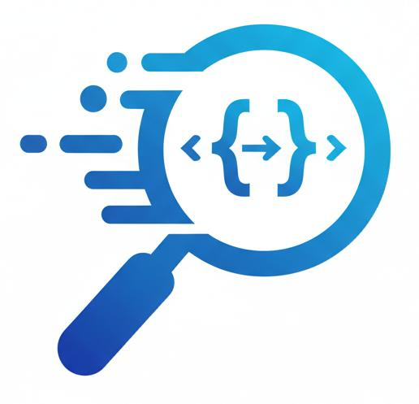
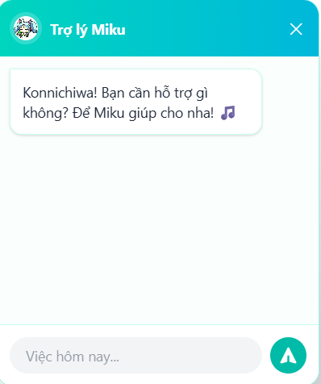

# OOP Lookup System - Hệ Thống Tra Cứu Lập Trình Hướng Đối Tượng

<div align="center">
  
  <br/>
  </div>

> **OOP Lookup System** là đồ án môn học Trí tuệ nhân tạo ,hệ tra cứu kiến thức Lập trình hướng đối tượng (OOP) , tích hợp **Trí tuệ nhân tạo (AI)**.


---

## 🚀 Tính Năng Nổi Bật (Key Features)

* 🤖 **AI Tutor Chatbot (CuteBot):** Tích hợp **Google Gemini 1.5 Flash** với kỹ thuật **RAG (Retrieval-Augmented Generation)**, giúp giải đáp thắc mắc dựa trên ngữ cảnh bài học thực tế.
* 🌳 **Cây Kiến Thức (Knowledge Tree):** Cấu trúc bài học phân cấp (Chương -> Bài -> Mục) trực quan, dễ dàng theo dõi tiến độ.
* 🔍 **Tìm Kiếm Thông Minh (Hybrid Search):** Kết hợp thuật toán **A* (Keyword Matching)** và **Vector Search (Semantic Search)** để đem lại kết quả chính xác nhất.
* 💻 **Đa Ngôn Ngữ Lập Trình:** Hỗ trợ xem ví dụ code song song giữa các ngôn ngữ **C++, Java, C#, Python**.
* ⚡ **Hiệu Năng Cao:** Sử dụng **Next.js Hybrid Rendering** và tối ưu hóa **App Shell** cho trải nghiệm mượt mà.

---

## 🛠️ Công Nghệ Sử Dụng (Tech Stack)

| Thành phần | Công nghệ |
| :--- | :--- |
| **Frontend** | Next.js 14, React, Tailwind CSS, Lucide React, Axios |
| **Backend** | Node.js, Express.js, JWT (planned), Bcrypt |
| **Database** | MongoDB Atlas, Mongoose ODM |
| **AI Engine** | Google Generative AI SDK (Gemini), Vector Embeddings |
| **Deployment** | Render (Web Service), Docker |

---

## 📂 Cấu Trúc Dự Án (Project Structure)

```bash
OOP-LOOKUP-SYSTEM/
├── backend/                 # Mã nguồn Backend (Server & API)
│   ├── src/
│   │   ├── config/          # Cấu hình Database
│   │   ├── controllers/     # Xử lý logic (AI, Search A*, Auth)
│   │   ├── models/          # Mongoose Schemas (Lesson, User...)
│   │   └── routes/          # API Endpoints
│   └── scripts/             # Script tạo Vector Embeddings
├── frontend/                # Mã nguồn Frontend (Next.js)
│   ├── src/
│   │   ├── app/             # App Router (Pages)
│   │   ├── components/      # UI Components (CuteBot, Tree...)
│   │   └── lib/             # Tiện ích (Axios config)
├── docs/                    # Tài liệu báo cáo đồ án
└── docker-compose.yml       # Cấu hình Docker

```

---

## ⚙️ Cài Đặt & Chạy (Installation)

### Yêu cầu tiên quyết

* [Node.js](https://nodejs.org/) (v18 trở lên)
* [MongoDB Atlas](https://www.mongodb.com/) (Connection String)
* [Google AI Studio API Key](https://aistudio.google.com/)

### 1. Cấu hình Backend

```bash
cd backend
npm install

# Tạo file .env và điền thông tin:
# MONGODB_URI=mongodb+srv://...
# GEMINI_API_KEY=AIzaSy...
# PORT=5001

npm start

```

### 2. Cấu hình Frontend

```bash
cd frontend
npm install

# Tạo file .env.local và điền thông tin:
# NEXT_PUBLIC_API_URL=http://localhost:5001/api

npm run dev

```

### 3. Chạy bằng Docker (Khuyên dùng)

Nếu máy bạn đã cài Docker, chỉ cần chạy 1 lệnh duy nhất:

```bash
docker-compose up --build

```

Truy cập ứng dụng tại: `http://localhost:3000`

---

## 👥 Thành Viên Thực Hiện (The Team)

Dự án được thực hiện bởi nhóm sinh viên Khoa Công nghệ Thông tin:

| STT | Họ và Tên | Mã Sinh Viên | Vai trò |
| --- | --- | --- | --- |
| 1 | **Nguyễn Hữu Minh Quân** | 49.01.104.120 | Leader, Fullstack Dev, AI Integration |
| 2 | **Bùi Minh Tín** | 49.01.104.152 | Backend Dev, Search Algorithms |
| 3 | **Nguyễn Thái Bình** | 49.01.104.011 | Content Creator, Database |
| 4 | **Võ Nguyễn Minh Hoàng** | 49.01.104.048 | Frontend UI, Tester |
| 5 | **Nguyễn Uyên Vy** | 49.01.104.180 | Documenter, Content |

---

## 📸 Demo Screenshots

### 1. Trang chủ & Cây kiến thức


### 2. Chatbot AI


---
## 🌐 Liên Kết (Deployment)

* **Frontend URL:** [https://oop-frontend.onrender.com](https://oop-frontend.onrender.com)
* **Backend API:** [https://oop-backend.onrender.com](https://oop-backend-mz4u.onrender.com)
